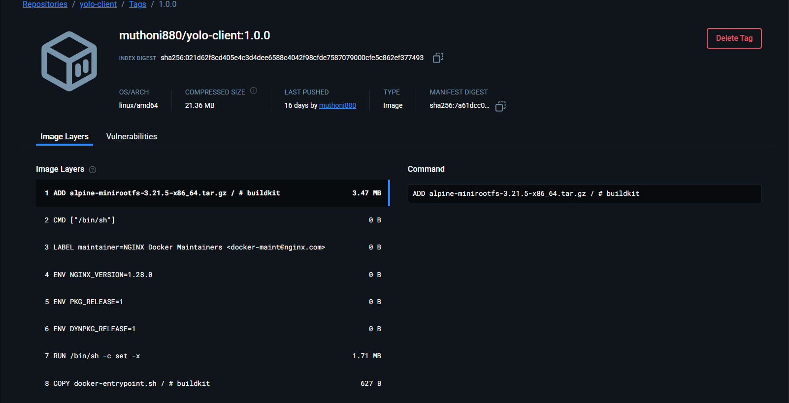

# YOLO E-Commerce Platform - Docker Implementation Explanation

## Overview
This document provides a comprehensive explanation of the containerization implementation for the YOLO e-commerce platform, detailing all architectural decisions, configuration choices, and deployment strategies.

---

## 1. Choice of Base Images

### Backend Container - `node:13.12.0`
- Matches the application's Node.js runtime requirements specified in `backend/package.json`
- Version 13.12.0 is a stable LTS-compatible release that provides all necessary npm functionality 
- Uses a full Node.js image to ensure compatibility with all dependencies including `multer`, `mongoose`, and `express`
- Docker image size is larger (~900MB) but ensures zero compatibility issues

### Client Container - `node:16-alpine` (Build Stage) + `nginx:stable-alpine` (Production)
- **Multi-stage Build:** Reduces final image size by excluding build artifacts, node_modules, and source code from production 
- Alpine images are security-hardened with minimal attack surface
- Nginx is optimized for static content delivery and reverse proxying to backend

### MongoDB Container - `mongo:5.0`
- Official MongoDB image provides reliable, well-maintained database service
- Version 5.0 is production-ready and compatible with Mongoose ODM used in the application

---

## 2. Dockerfile patterns
- Use `FROM` to select the base image.
- Use `WORKDIR` to set the working directory.
- Copy package manifests first and install dependencies (leverages Docker layer caching):
  - `COPY package*.json ./`
  - `RUN npm ci --only=production` (or `npm ci` in the build stage)
- Copy source: `COPY . .`
- Build step (client): `RUN npm run build` to produce production assets.
- Use multi-stage builds for client to produce a small runtime image.
- Use `EXPOSE` to document container ports (e.g., `5000` for backend, `80` for client). Publishing to the host is done via docker-compose or `docker run -p`.
- Prefer `CMD` or `ENTRYPOINT` as appropriate:
  - Backend: `CMD ["node", "server.js"]`
  - Client (nginx): `CMD ["nginx", "-g", "daemon off;"]`

## 3. Docker Compose: networking & ports
- Use a custom bridge network (e.g., `yolo-network`) so services can resolve each other by name (e.g., `mongo`).
- Example port mappings:
  - backend: `5000:5000`
  - client: `3000:80` (React/static app available at `http://localhost:3000`)

## 4. Data persistence
- Use a named volume for MongoDB:
  - `volumes: - mongo-data:/data/db`
- This ensures data persists across container restarts.
- MongoDB persistence was tested by adding products, stopping and restarting containers, and confirming the data remained available. The project was pushed to GitHub and successfully run from a fresh clone using docker-compose.

## 5. Git workflow
- Branching: create feature branches from `master` (e.g., `feature/dockerize`).
- Commit style: small, focused commits (e.g., `add backend Dockerfile`).
- Open pull requests for review before merging to `master`.

## 6. Running & debugging
- Build and run: `docker-compose up --build`
- Backend DB connection: set `MONGODB_URI=mongodb://mongo:27017/yolomy` so the backend resolves the DB service via Compose DNS.
- Logs:
  - `docker-compose logs -f backend`
  - `docker-compose logs -f mongo`
- Node version issues: check `engines` in `client/package.json` and adjust base image accordingly.

## 7. Image tagging & release practices
- Always use explicit tags (avoid `latest`), e.g., `muthoni880/yolo-backend:1.0.0`.
- For CI/CD, use semantic versioning and include build metadata (or image digests) for traceability.

## 8. Security & reliability recommendations (additional)
- Run containers as a non-root user when possible.
- Add `HEALTHCHECK` for critical services (backend, database) and use container restart policies.
- Don’t store secrets in images; use environment variables, Docker secrets, or a secrets manager.
- Add resource limits in Compose (cpu/memory) for production deployments.

## 9. Development convenience
- Add a `.dockerignore` to exclude node_modules, logs, .git, and other unnecessary files.
- Consider `docker-compose.override.yml` for development-specific overrides (volumes, hot-reload).

## 10. DockerHub verification
- After pushing images, include screenshots on the repository or docs showing the repositories and tags, e.g.:
  - 
  - 

# Explanation

This document explains the structure and reasoning behind the order of execution in my Ansible playbook for deploying the e-commerce application.

## Playbook Execution Order

The playbook runs roles in the following order:

```
pre_tasks → docker → clone_repo → mongodb → backend → client → post_tasks
```

## Why the Order Matters

Each role is dependent on the previous one. Changing the order would break the deployment:

- Docker must be installed before any containers can run.
- The repository must be cloned before building Docker images.
- MongoDB must be running before the backend can connect to it.
- The backend must be running before the frontend can communicate with it.

## Role Functions and Positioning

### 1. Pre-tasks
- Updates apt and installs essential packages (git, curl, python3-pip).
- **Modules**: `apt`
- **Tags**: setup

### 2. Docker Role
- Installs Docker Engine and Docker Compose.
- Starts Docker daemon.
- Installs Python Docker library for Ansible.
- **Modules**: `apt_key`, `apt_repository`, `apt`, `service`, `user`, `get_url`, `pip`, `docker_container`
- **Tags**: docker, setup

### 3. Clone Repo Role
- Creates the project directory.
- Clones the application code from GitHub.
- Sets up environment files and image folders.
- **Modules**: `file`, `git`, `copy`, `debug`
- **Tags**: clone, setup

### 4. MongoDB Role
- Creates Docker network for inter-container communication.
- Creates a persistent volume for MongoDB data.
- Pulls and runs the MongoDB container.
- Waits for MongoDB to be ready.
- **Modules**: `docker_network`, `docker_volume`, `docker_image`, `docker_container`, `wait_for`, `docker_container_info`, `debug`
- **Tags**: mongodb, containers

### 5. Backend Role
- Builds the backend Docker image using the Dockerfile.
- Removes any existing backend container.
- Runs the backend container, connects it to the network, sets environment variables, and mounts the images volume.
- Waits for the backend to be ready.
- **Modules**: `docker_image`, `docker_container`, `wait_for`
- **Tags**: backend, containers

### 6. Client Role
- Builds the frontend Docker image.
- Removes any existing client container.
- Runs the client container (nginx), connects it to the network, and waits for it to be ready.
- **Modules**: `docker_image`, `docker_container`, `wait_for`
- **Tags**: client, containers

### 7. Post-tasks
- Displays URLs for accessing the application.
- **Modules**: `debug`

## Variables

Configuration variables are stored in variable files (e.g., `group_vars/all.yml`, `host_vars/ubuntu_vm.yml`). This makes it easy to change settings like ports or environment variables in one place.

## Blocks and Tags

- **Blocks**: Used to group related tasks, such as all Docker installation steps.
- **Tags**: Allow running or skipping specific parts of the playbook for testing or troubleshooting (e.g., `--tags backend`, `--skip-tags mongodb`).

## Testing

To verify the deployment:
1. Run `vagrant up`
2. Access the frontend at http://localhost:3000
3. Add a product using the form
4. Restart the VM with `vagrant reload` and confirm data persistence

## Summary

The order of roles ensures all dependencies are met:
- Docker is required for containers.
- The code must be present to build images.
- MongoDB must be running before backend starts.
- Backend must be running before frontend starts.

This structure guarantees a reliable and repeatable deployment process.